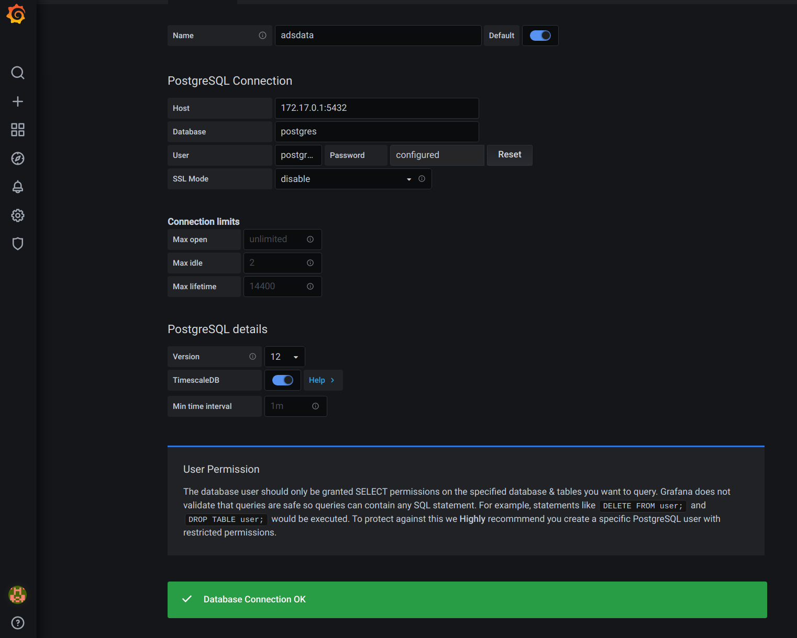
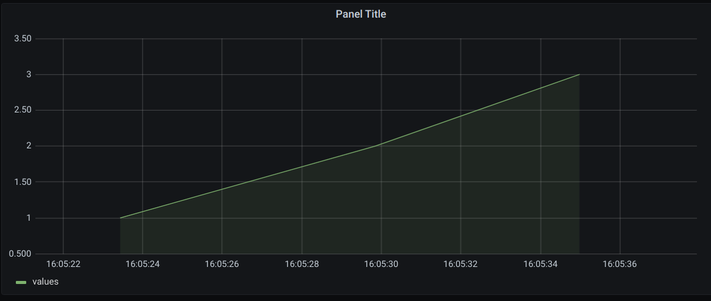

# ads-demo-environment
[](https://concourse.ci4rail.com/teams/main/pipelines/ads-demo-environment) [](https://goreportcard.com/report/github.com/ci4rail/ads-demo-environment)

This repository contains the components of ads-demo-environment, build environment and CI/CD pipeline and their deplyoment to aks.

# Build
Here you can find the build instructions for either locally with and without docker and via the CI/CD pipeline.

## Build locally

### eventhub2db

#### Docker image

To build (and deploy) the `eventhub2db` docker image you can use the following commands:
```bash
$ ./dobi.sh image-eventhub2db        # build only
$ ./dobi.sh image-eventhub2db:push   # build and push do docker registry
```

To run the docker image with a specific `<tag>` use:
```bash
docker run --rm -e EVENTHUB_CONNECTIONSTRING="Endpoint=sb://testing-ns4tenant2.servicebus.windows.net/;SharedAccessKeyName=ar4tenant2;SharedAccessKey=A...;EntityPath=eh4tenant2" harbor.ci4rail.com/ci4rail/kyt/kyt-dlm-server:<tag>
```
Have a look at available tags for the image: https://harbor.ci4rail.com/harbor/projects/7/repositories/kyt%2Feventhub2db

#### Plain binary

Containerized Build of the kyt-dlm-server tool. Builds x86 version for linux.

```bash
$ ./dobi.sh build-kyt-dlm-server
```

Run the kyt-dlm-server:

```bash
$ export EVENTHUB_CONNECTIONSTRING="Endpoint=sb://testing-ns4tenant2.servicebus.windows.net/;SharedAccessKeyName=ar4tenant2;SharedAccessKey=A...;EntityPath=eh4tenant2"
$ bin/kyt-dlm-server --addr :8080
```

Or, build/run it with your local go installation:

```bash
$ cd kyt-dlm-server
$ go run main.go  --addr :8080
```

## Build with CI/CD

[Concourse CI](https://concourse-ci.org/) will be used as CI/CD system.

Download `fly` and login to concourse CI server.

```bash
# Download fly from concourse server
$ sudo curl -L https://concourse.ci4rail.com/api/v1/cli?arch=amd64&platform=linux -o /usr/local/bin/fly && sudo chmod +x /usr/local/bin/fly
# Login to concourse
$ fly -t prod login -c https://concourse.ci4rail.com
```
## pipeline.yaml

The `pipeline.yaml` is the CI/CD pipeline that builds eventhub2db docker image. The eventhub2db image will be published as docker image [here](https://harbor.ci4rail.com/harbor/projects/7/repositories/kyt%2Feventhub2db).

### Usage

Copy `ci/credentials.template.yaml` to `ci/credentials.yaml` and enter the credentials needed (for docker registry credetials `yoda harbor robot user` from bitwarden can be used, `access_token` can be found in `yoda-ci4rail github token` from bitwarden). The `access_token` needs `read` rights on Github.
Apply the CI/CD pipeline to Concourse CI using
```bash
$ fly -t prod set-pipeline -p ads-demo-environment -c pipeline.yaml -l ci/config.yaml  -l ci/credentials.yaml
```

## pipeline-pullrequests.yaml

The `pipeline-pullrequests.yaml` defines a pipeline that runs basic quality checks on pull requests. For this, consourse checks Github for new or changed pull requests If a change is found, it downloads the branch and performs a clean build of kyt-cli `kyt` and `kyt-dlm-server` go binaries. It also runs go test for both.

### Usage

Copy `ci/credentials-pullrequests.template.yaml` to `ci/credentials-pullrequests.yaml` and enter the Github `access_token` with `read` rights and enter the `webhook_token` key, you want to use (`yoda-ci4rail github pullrequest token` from bitwarden can be used).
Configure a Webhook on github using this URL and the same webhook_token:
`https://concourse.ci4rail.com/api/v1/teams/main/pipelines/kyt-services-pull-requests/resources/pull-request/check/webhook?webhook_token=<webhook_token>`

Apply the pipeline to Concourse CI using
```bash
$ fly -t prod set-pipeline -p ads-demo-environment-pull-requests -c pipeline-pullrequests.yaml -l ci/credentials-pullrequests.yaml
```

# Test environment
## TimescaleDB Server

Start server with
```
docker run -d --name timescaledb -p 5432:5432 -e POSTGRES_PASSWORD=password timescale/timescaledb:2.1.0-pg13
```

## TimescaleDb Go Client
Run local go program to
* Extend the database with TimescaleDB (if not happed before)
* Create table if not exists
* Insert columns if not exist
* Convert the table created into a hypertable (if not exists)
* Insert sample data into database

Precoditions:
* local docker container stared as noted in [TimescaleDB Server](#TimescaleDB-Server)

Execute it
```
go run main.go
```

## TimescaleDB Docker Client
Run interactive client in docker container and connect to PostgreSQL, using a superuser named 'postgres':
```
docker exec -it timescaledb psql -U postgres
```

Show the last 100 entries in the table:
```
SELECT * FROM adsdata ORDER BY time DESC LIMIT 100;
```

### Grafana
Run as docker container:
```
docker run -d --name=grafana -p 3000:3000 grafana/grafana
```

Connect grafana to local TimescaleDB server:
* In broser open http://localhost:3000/
* Go to Configuration -> Data Sources
* Select PostgreSQL
* Enter the data as shown in the following figure


> The password needs to fit the value of POSTGRES_PASSWORD from [TimescaleDB Server](#TimescaleDB-Server)

> The ip adress from docker interface docker0 needs to be entered as host ip adress

Insert data into Grafana panel:
* Go to Create -> Dashboard
* Click on `Add new panel`
* Check selected data sourse is `adsdata`
* Click on the pen next on the right side of the A query to toggle to text mode
* Enter the following to show the course of the parameter counter
  ```
  SELECT
    "time" AS "time",
    ((data->>'counter')::numeric) as values
  FROM adsdata
  WHERE
    $__timeFilter("time")
  ORDER BY 1
  ```

Example output:

